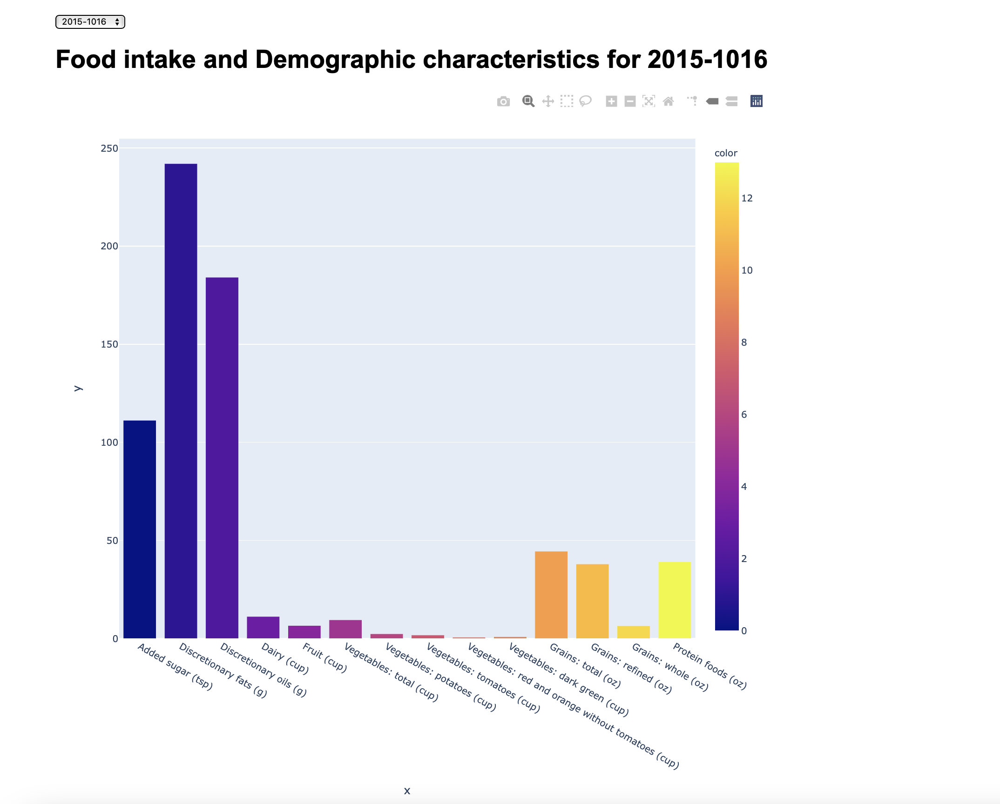
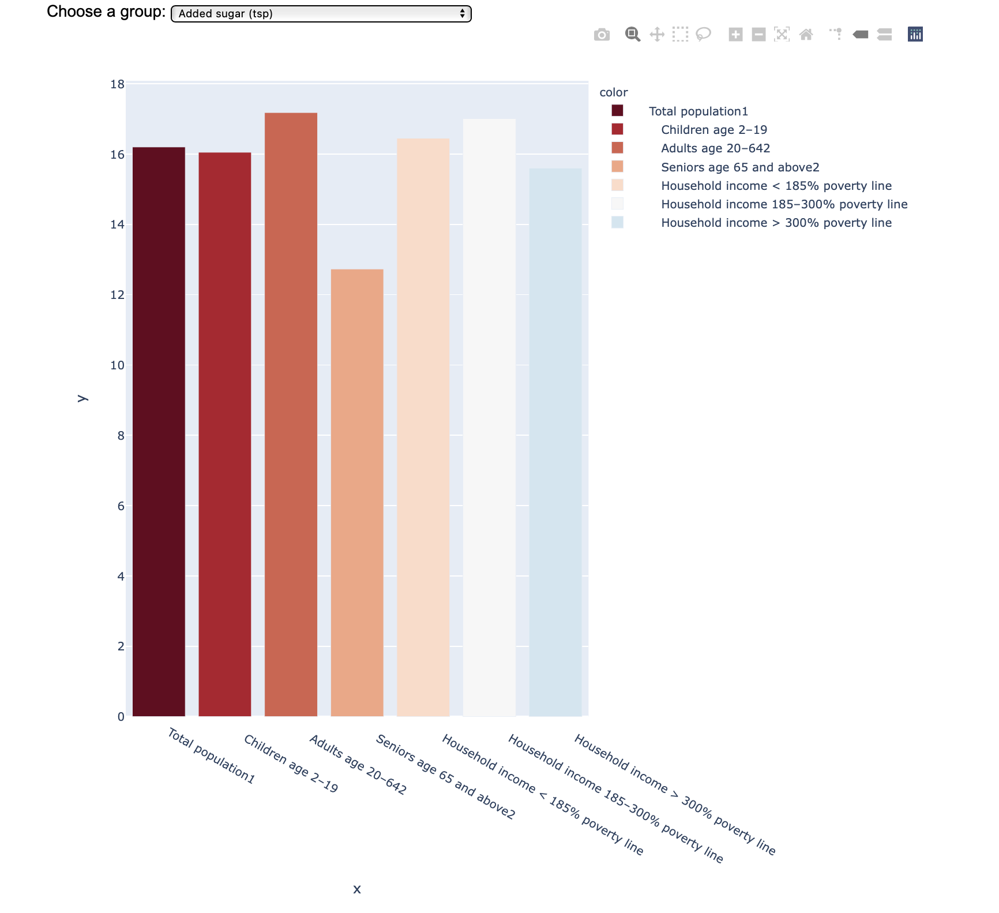
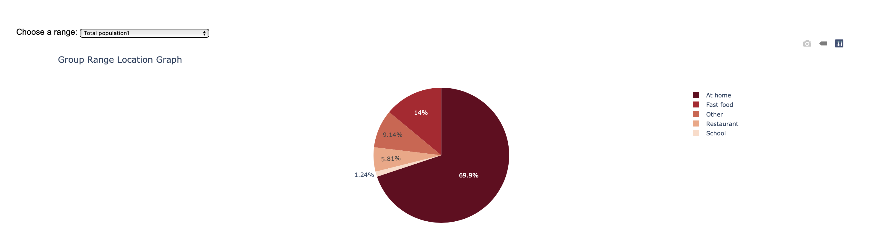

# Food Consumption Analysis- Foodies 


## Table of Contents
* [Project Summary](#project-summary)
* [Research Questions](#research-questions)
* [Data Sources](#data-sources)
* [Technologies](#technologies)
* [Libraries & Dependencies](#libraries-dependencies)
* [Data Cleaning](#data-cleaning)
* [Data Visualization](#data-visualization)
* [Setup](#setup)
* [Website Pages](#website-pages)
* [Reports](#reports)
* [Team](#team)

## Project Summary

* In this project we chose to analyze food comsumption and security catigorized by food groups in mutiple countries around the world. We believe that proper nutrition is very important but the truth is that it is easy to have bad eating habits without ever realizing so hopefully this website can shed light on some unhealthy eating habits.
* We used Mongo, Javascript, HTML and python in order to create a website that projects all our findings in a way that can be viewed and used by people curious about the subject.

## Research Questions

*  Which Countries consume the most of each food group?
*  What was the most consumed food group throughout the world?
*  Which Country has the most balanced diet?
*  What is the Impact of Covid on food insecurity? 
*  Is there a difference in food consumption based on different demographics? (E.g., Children, Adults, Seniors, and various household income levels)
*  What can we conclude through the findings?

## Data Sources

* (https://www.kaggle.com/mariaren/covid19-healthy-diet-dataset?select=Food_Supply_Quantity_kg_Data.csv)
* (https://github.com/bdorsey2/world_food_consumption_data_vis)

### Additional Sources 
* (https://potsplantersandmore.com/blog/their-fair-share-food-production-and-consumption-in-america/)
* (https://www.bls.gov/cex/tables/geographic/mean.htm#select)
* (https://feedingamericaaction.org/resources/state-by-state-resource-the-impact-of-coronavirus-on-food-insecurity/)

## Technologies

* Python
* Flask
* Javascript
* HTML/ CSS
* Bootstrap
* Plotly
* JSON
* MongoDB

## Libraries & Dependencies

**Libraries**
* [JavaScript Libraries](https://medium.com/javascript-in-plain-english/best-javascript-data-visualization-libraries-for-2020-15291919a176)
* [Bootstrap](https://getbootstrap.com/docs/4.0/getting-started/introduction/)

**Python Dependencies**
* Pandas
* Numpy
* Flask
* Flask_pymongo
* Pymongo


## Data Cleaning

### Selecting Data Sources 

* Our main data source was found at the US Department of Agriculture Website:  USDA ERS (https://www.ers.usda.gov/topics/food-choices-health/food-consumption-demand/food-consumption/). The raw data was obtained in a CSV format.
* We started off by importing the Pandas library and loading the data set into a pandas dataframe
* A for loop was used to to clean multiple columns at once. The loop iterates through every element of a list and make adjustments by dropping all null columns


* We stored the dataframes into a dictionary because our data contains a list of different food sources (Exc: oil vegetables, fats, dairy, etc) and the list was added to the dictionary against the columns


* After having all of our columns in the proper format, we used the dictionary to create the database


## Data Visualization
### Total food intake by year (2015-2016 & 2017-2018)

### Food group consumption by demographic

### Location of food acquisition for consumption by demographic (where are you getting food to eat)


##  Setup

**NOTE**: The followings files were involved in web-scraping or used to create csvs that were imported into the Mongo DB and DO NOT need to be run: 
- databasecreate.ipynb
- database.ipynb
- datacleaner.ipynb


#### Setup Instructions

- For the database, we used MongoDB. We integrated MongoDB with flask using flask PyMongo
- All files are currently set up to create the Mongo DB and run locally.  If you want to run them using the cloud Mongo server, use the alternative steps provided in bullets below:  

0) install ```pip install flask``` and ```pip flask-pymongo```
    * if running cloud mongo, also ```pip install dnspython``` to your environment
1) create an app.py file and add PyMongo to our code and replace ```<password> and <dbname>``` in your connection string with your password and database name
2) test our app by executing app.py and go to http://127.0.0.1:5000/test . If it worked, then we can proceed further.
3) after the connection is done, we inserted the dictionary
4) perform CRUD HTTPS Methods (GET, POST, PUT, DELETE)
   
   
## Website Pages
   
### Home
 * Landing page
   
### Menu


- Placeholder for future nutritional recipes
- One of the reasons we chose to take a closer look at personal food consumption in this project is because it can be easy to overeat and it can be hard to know what the proper intake levels should be for a single meal
- Also, when making food at home it can be hard to measure your food intake. To combat the issue of inproper intake levels we created a menu page as a place to showcase nutritional recipes people can make at home, along with helping people gain a better understanding of what a proper balanced meal consists of.
 
### News

We embedded a tableu dashboard in our website from the website Feeding America: (https://www.feedingamerica.org)

 * The visualization below shows how food insecurity and very low food security may have increased in 2020 and may increase in 2021 due to COVID-19 for the overall population and children by state, county, and congressional district. Click on each dashboard tab to view projected changes in food insecurity as a result of COVID-19 by county, congressional district, and state.


 * Shows the food insecurity rates (total & child) due to covid-19 for multiple years. This page shows a map view of every county for all states in the United States.


### Map
 * Showcases food consumption in multiple countries

## Reports
At the end of the project some conclusions we found were...
1. The most consumed food group was protein followed by grains, then vegetables, and fruit
2. The least consumed food group was discretionary fats, oils, and added sugars followed by fruits
3. People eat most of their meals at home followed by fast food and we found that people eat more at fast food establishments than actual restaurants.
4. Food insecurity rates are higher now compared to 2019 but even in 2019, child food insecurity rates were worse than total food insecurity rates. (for NJ)

## Team 
Created by:
* [@sammyschapps87](http://github.com/sammyschapps87)
* [@applepassion4](http://github.com/applepassion4)
* [@ssrivastav0494](http://github.com/ssrivaatav0494)
* [@Joshp1219](http://github.com/Joshp1219)
